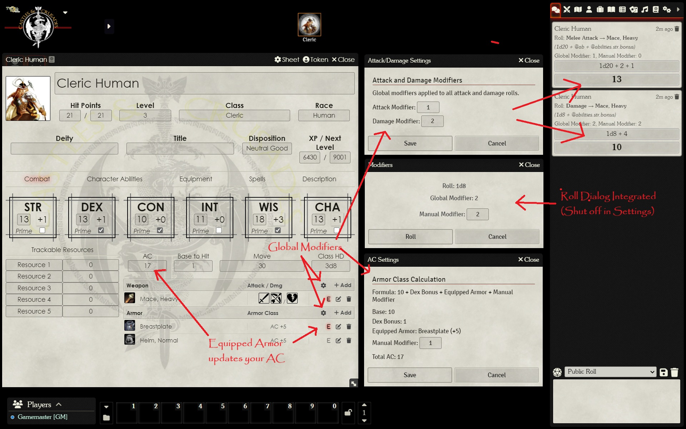
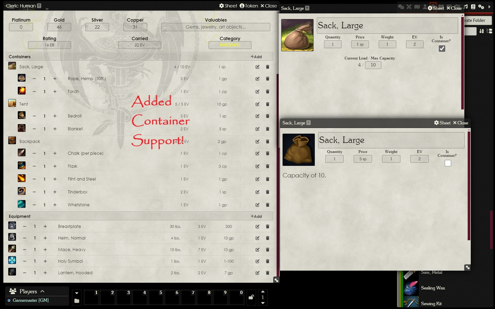
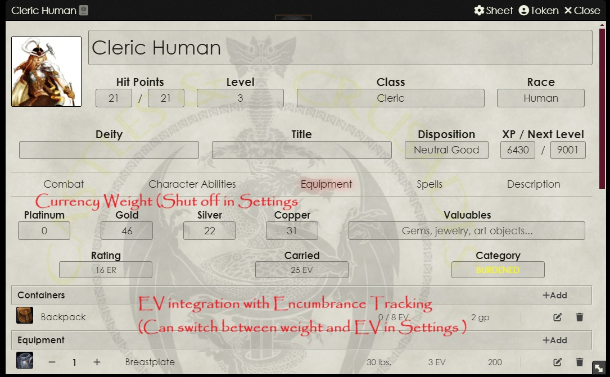

# Castles & Crusades Backpack

A Foundry VTT module for enhanced inventory management in the Castles & Crusades system.

## Features
- **Container Support**: Create containers with capacity tracking (EV or lbs) and drag-and-drop items into them for nested inventory management.
- **Encumbrance Tracking**: Track encumbrance in either Encumbrance Value (EV) or pounds (lbs), configurable via settings.
- **Currency Weight**: Toggle coin weight inclusion in encumbrance calculations (160 coins = 1 EV or 10 lbs).
- **Quantity Management**: Adjust item quantities with increment/decrement buttons.
- **Global Modifiers**: Apply global attack and damage modifiers to rolls, configurable via the combat tab.
- **Roll Dialog Integration**: Enhanced roll dialog for attack and damage rolls with global and manual modifiers (can be disabled in settings).
- **Automatic AC Updates**: Equipped armor automatically updates your AC, with manual modifier support via the AC settings dialog.

## Screenshots

### Attack and Damage Modifiers
Apply global modifiers to attack and damage rolls via the combat tab.

### Container Support
Organize items into containers with capacity tracking.

### Encumbrance Tracking
Track encumbrance in EV or lbs, configurable in settings.

## Installation
1. Install via the Foundry VTT module browser using the manifest URL: `https://github.com/FistanRaist/cnc-backpack/releases/latest/download/module.json`.
2. Alternatively, download the latest release (`module.zip`) from `https://github.com/FistanRaist/cnc-backpack/releases/download/v1.0.0/module.zip` and extract it to your Foundry VTT `Data/modules` folder.
3. Enable the module in your world.
4. Ensure the `castles-and-crusades` system is active in your world.

## Usage
- Open an actor sheet and navigate to the **Equipment** tab.
- Create a container by clicking "+Add" under the **Containers** section.
- Drag items into containers or the main inventory to organize them.
- Toggle the "Is Container?" checkbox on an item sheet to convert an item into a container.
- Adjust encumbrance mode and coin weight settings in **Game Settings > Configure Settings > cnc-backpack**.
- In the **Combat** tab, use the gear icons to set global attack/damage modifiers or adjust AC calculations.

## Requirements
- Foundry VTT v12 (minimum version 12, verified with 12.331).
- Castles & Crusades system (`castles-and-crusades`) installed and active.

## Known Issues
- Dropping items from the sidebar may fail if the actor lacks permission to create items.
- Performance may lag slightly with very large inventories due to sheet re-rendering (optimization in progress).
- Edge cases with malformed item data (e.g., missing `ev` or `weight`) are handled with fallbacks but may not reflect intended rules.

## Contributing
Feel free to submit issues or pull requests on the [GitHub repository](https://github.com/FistanRaist/cnc-backpack). Feedback from Castles & Crusades players is especially welcome!

## Support
For issues, questions, or feature requests, please open an issue on the [GitHub repository](https://github.com/FistanRaist/cnc-backpack/issues) or contact the author via the Foundry VTT Discord community.

## Version History
See the [CHANGELOG.md](CHANGELOG.md) file for a detailed changelog of all versions and updates.

## License
This module is released under the MIT License. See the `LICENSE` file (if included) for details.